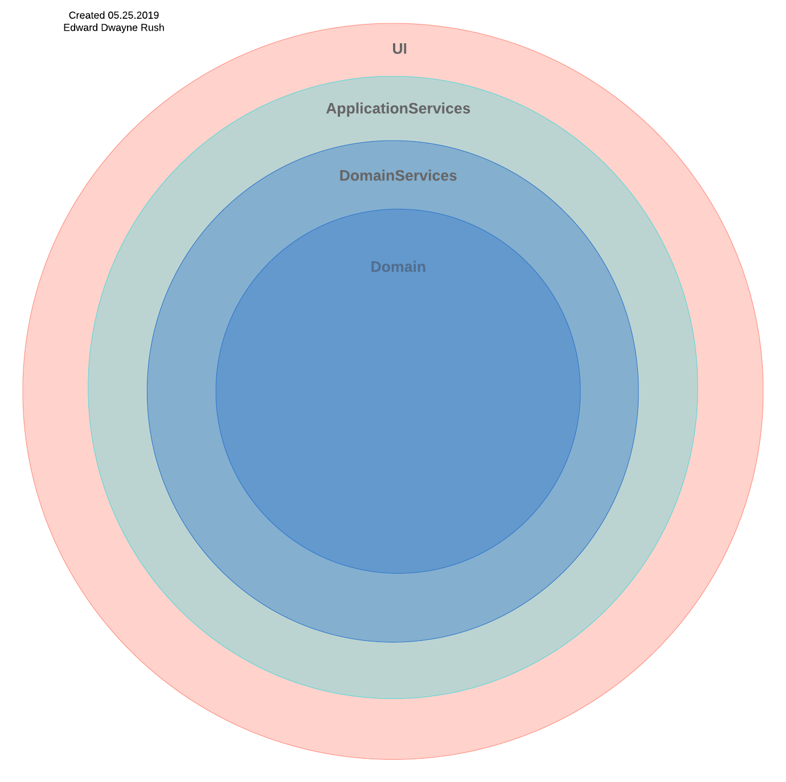

#Domain Service Assembly

The Domain Service Assembly provides access to the Application Repository as well a operations that do not fit with the Application Services Layer, nor in the Domain Layer.

|Project Name|Project Description|
|-----|-----|
|DomainServices|Repositories, Factories, Domain Services. This is C# code shared for the iOS and Android compiled Applications. This Project dependencies should be limited to Database, File and Serialization and Deserialization operations.|

See explanation of all layers below.

|Project Name|Project Description|
|-----|-----|
|ApplicationServices|Main Application services for ViewModels, and Gateways. This is code potentially shared and used for the iOS and the Android compiled Applications. This is where the bulk of code occurs with communication proxied through from the UI to DomainServices. Additionally, this is where the  Dependency Injection System would be loaded with Object References for sharing between the UI, Application Services and Domain Service.|
|Domain|Entities, Value Objects, Domain Events, Aggregates. This is code shared for the iOS and Android compiled Applications. This is the Center of the entire Application should have no dependencies from on higher levels. There is a Dependency on the NewtonSoft JSON Engine so Objects can be decorated for Serialization.|
|DomainServices|Repositories, Factories, Domain Services. This is C# code shared for the iOS and Android compiled Applications. This Project dependencies should be limited to Database, File and Serialization and Deserialization operations.|
|iOS|iOS Platform Project where the .app is generated. This UI Layer will exist at this level|
|UI|We do not have a UI project specific for this Test Application as the UI Level will reside in the iOS Project.|

 

